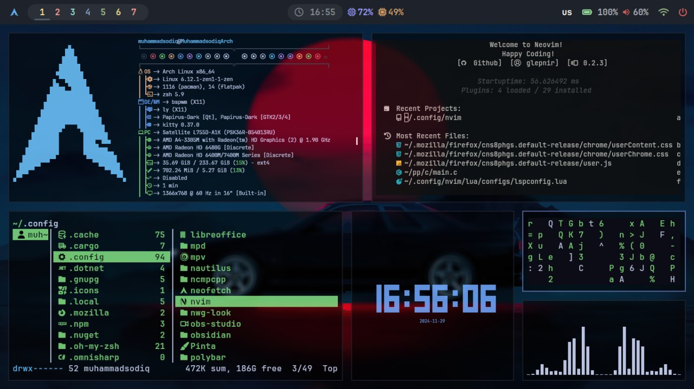
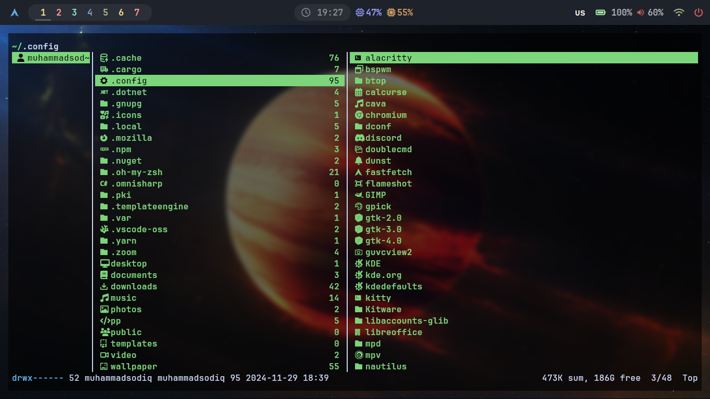
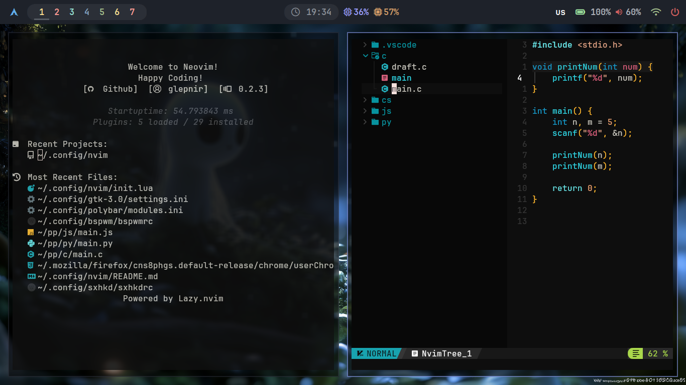
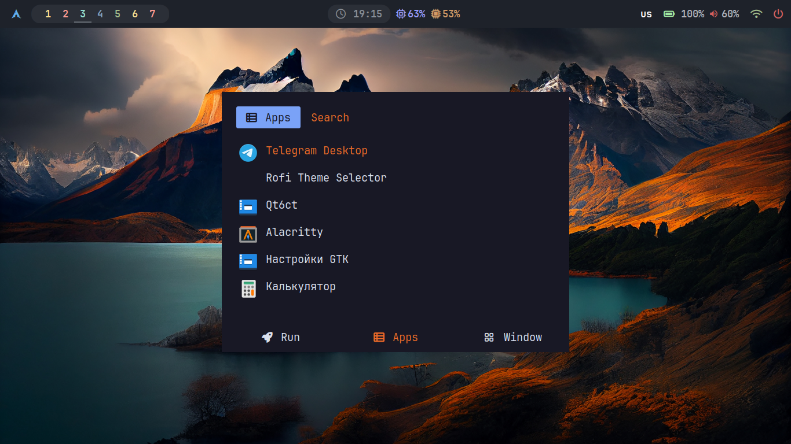
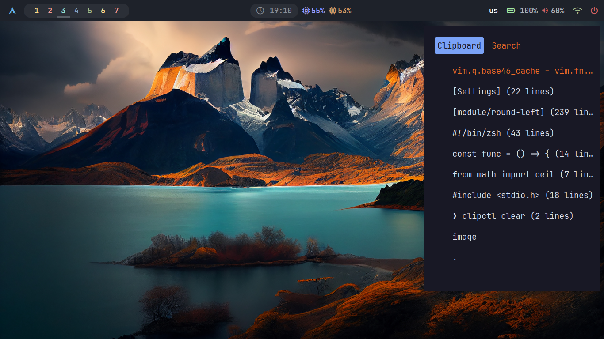
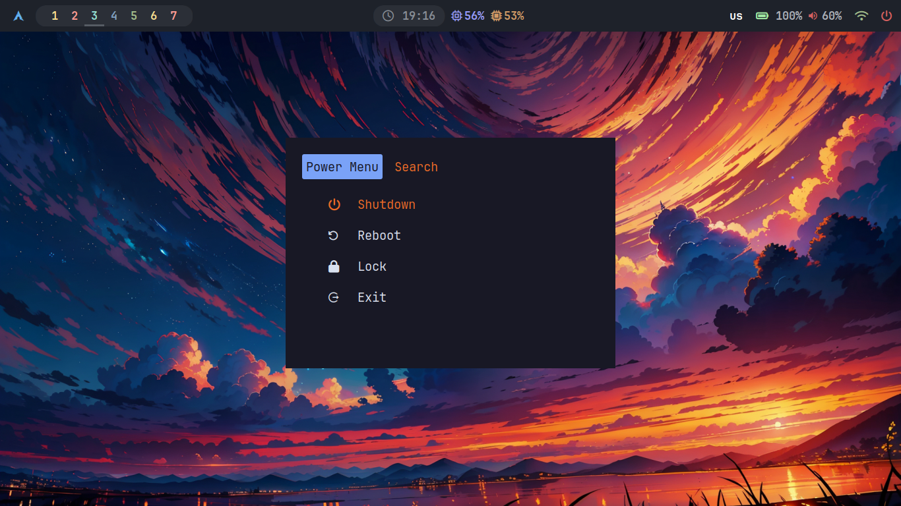

### OS: [Arch Linux](https://archlinux.org/)
### WM: [BSPWM](https://github.com/baskerville/bspwm)
### Shell: [ZSH](https://www.zsh.org/)
### Teminal: [alacritty](https://alacritty.org/), [kitty](https://github.com/kovidgoyal/kitty)
### Text/Code Editor: [nvim](https://neovim.io/)
### File Manager: [ranger](https://github.com/ranger/ranger)
### Status Bar: [polybar](https://github.com/polybar/polybar)
### Menu Manager: [rofi](https://github.com/adi1090x/rofi)
### Notify Manager: [dunst](https://dunst-project.org/)

### Ranger
You can configure it on `~/.config/ranger/rc.conf` file. You can also edit icons on `~/.config/ranger/plugins/ranger_devicons/devicons.py`.
See more details on `https://github.com/ranger/ranger`

### [Neovim](https://neovim.io/)

### [Rofi](https://github.com/adi1090x/rofi)

