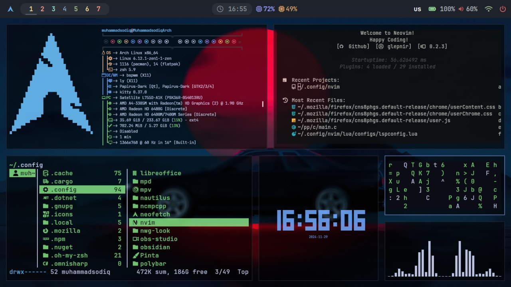
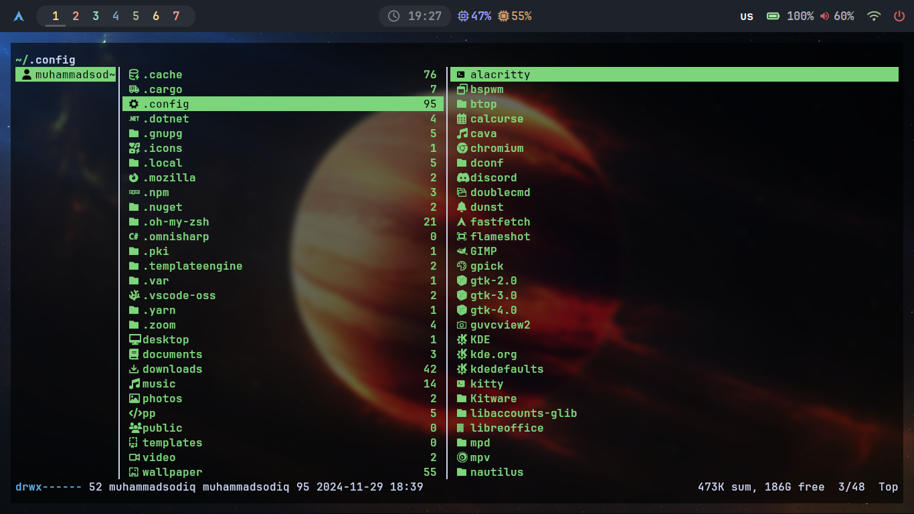
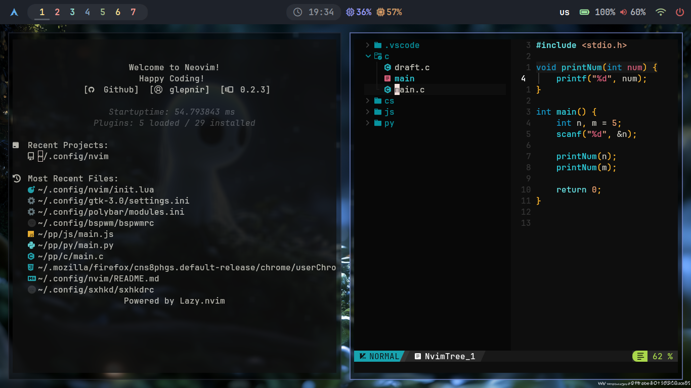
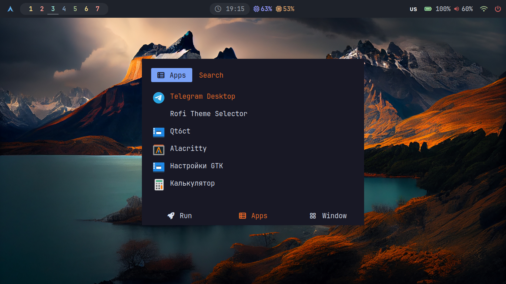
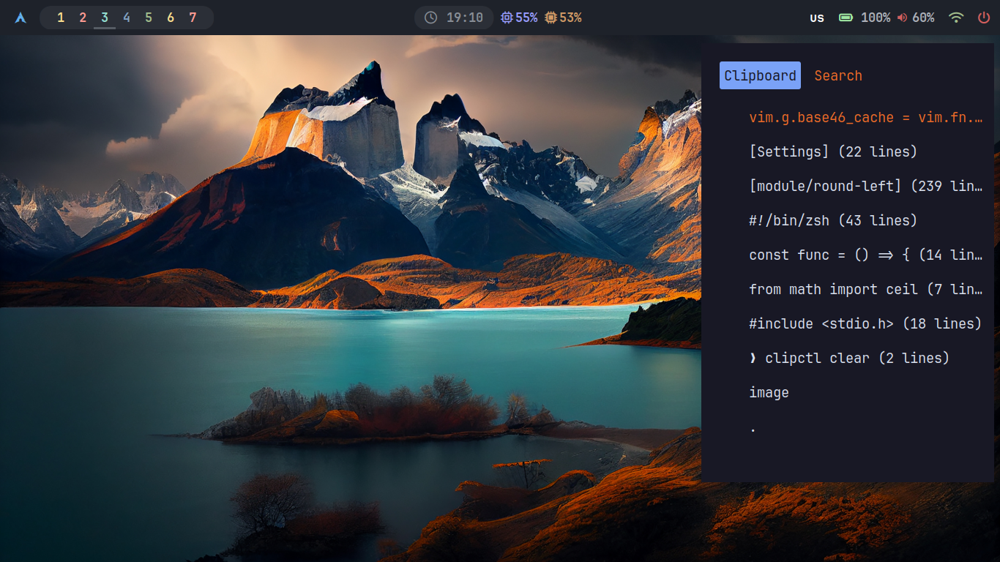
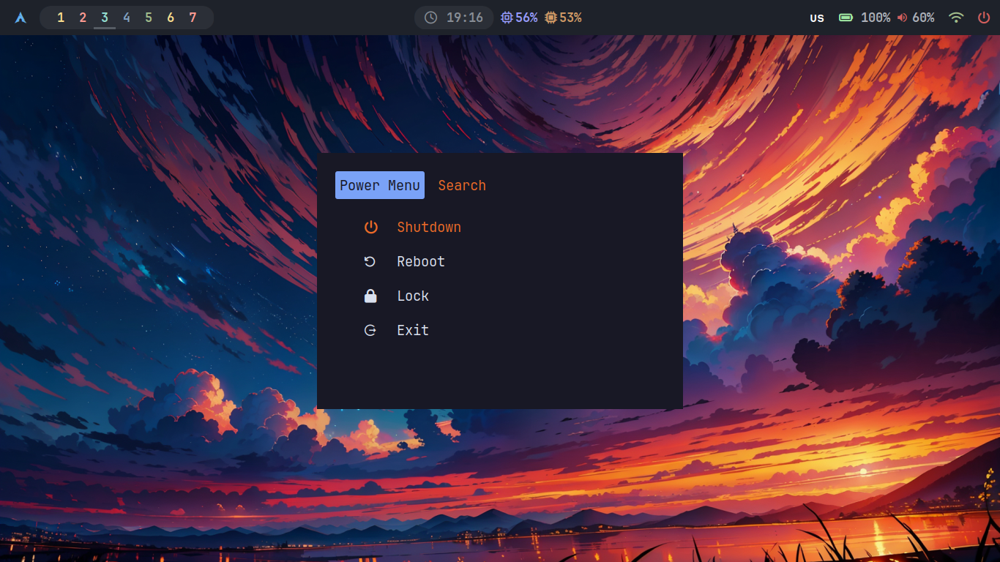

# DO NOT CLONE THIS REPOSITORY! It is not build, cloning this repository cannot give you this configuration. You can copy what you need from the repository files to yours

### OS: [Arch Linux](https://archlinux.org/)
### WM: [BSPWM](https://github.com/baskerville/bspwm)
### Keybindings: [SXHKD](https://github.com/baskerville/sxhkd)
### Shell: [ZSH](https://www.zsh.org/)
### Teminal: [kitty](https://github.com/kovidgoyal/kitty), [alacritty](https://alacritty.org/)
### Text/Code Editor: [nvim](https://neovim.io/)
### File Manager: [ranger](https://github.com/ranger/ranger)
### Status Bar: [polybar](https://github.com/polybar/polybar)
### Menu Manager: [rofi](https://github.com/adi1090x/rofi)
### Notify Manager: [dunst](https://dunst-project.org/)

### Ranger
You can configure it on `~/.config/ranger/rc.conf` file. You can also edit icons on `~/.config/ranger/plugins/ranger_devicons/devicons.py`
See details on `https://github.com/ranger/ranger`

### [Neovim](https://neovim.io/)
Read the `README.md` file on this repository on `HOME/.config/nvim/` directory

### [Rofi](https://github.com/adi1090x/rofi)

